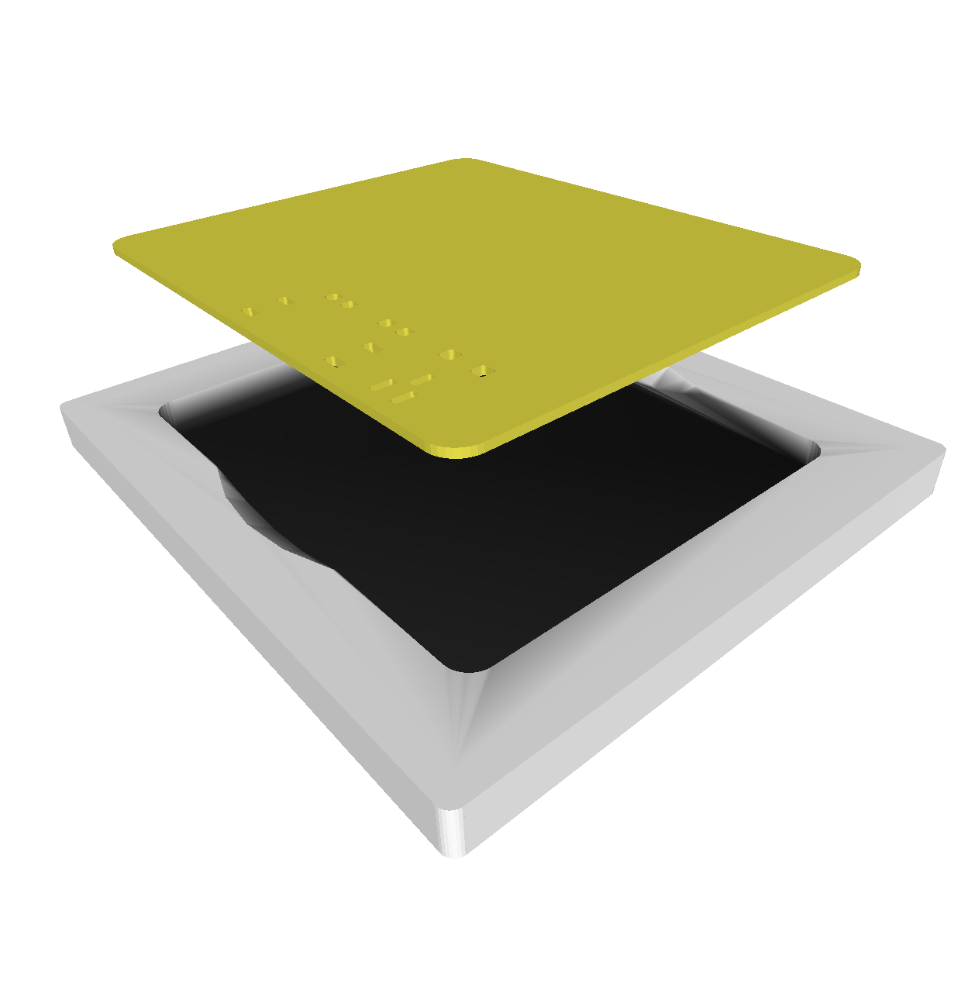

# Stencil printer project

This is a project to create stencils to apply solderpaste to SMD soldering parts based on the front paste and board outline layers of KiCad. And to print them with a FDA 3D printer.

## Concept

The concept is based on the following workflow:

1. Design the board in KiCad
2. Based on the completed board design plot the *Front Paste* and the *Edge Cut* (or a custom layer containing the outer board line) in DXF format
3. Execute the `create_stencil.py` script pointing to the generated dfx files and providing critical parameters like board dimensions, stencil height and tolerance
4. Print the two created STL files (`stencil.stl` and `frame.stl`) with a 3D Filament printer using the special settings described below

This will provide you with a stencil as high as you defined it and a fitting frame that can serve as an applying jigg to take the pcb and the stencil on top of it and fix them into position, so that you can apply the solder paste (see pictures below):

Although it requires some post processing of the stencil's whole and there is of course a minimum size of the pads (before the stencil prints with a full hole for one side of the IC) but the results are remarkably well without a lot of 3D printer tuning (I am not an expert in this).
It works best for the hand-soldering pad sizes that KiCad offers. 

## Design

## Usage